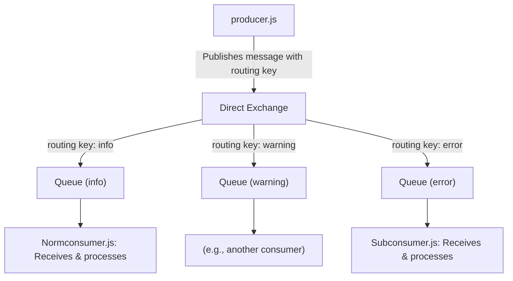

# Direct Exchange - RabbitMQ

## Introduction
A Direct Exchange in RabbitMQ is a type of exchange that routes messages to queues based on a message routing key. It delivers messages to queues whose binding key exactly matches the routing key of the message.

## Explanation
In a direct exchange, the routing algorithm is simple: a message goes to the queues whose binding key exactly matches the routing key of the message. This is useful for unicast routing (one-to-one) or multicast routing (one-to-many) with exact matching.

## Use Case
Direct exchanges are ideal for scenarios where you want to deliver messages to specific queues based on a precise identifier, such as:
- Task distribution systems
- Notification systems where each type of notification has its own queue
- Logging systems with different log levels (info, warning, error)

## Architecture
- **Producer**: Sends messages with a specific routing key to the direct exchange.
- **Direct Exchange**: Forwards messages to queues whose binding key matches the routing key.
- **Queue(s)**: Receive messages if their binding key matches the message's routing key.
- **Consumer(s)**: Listen to queues and process messages.

## Example
Suppose you have a direct exchange named `direct_logs` and three queues bound with binding keys `info`, `warning`, and `error`.
- A message with routing key `error` will only go to the queue bound with `error`.

## Architecture Flow
1. The producer connects to RabbitMQ and sends a message to the direct exchange with a routing key.
2. The direct exchange checks all bindings and routes the message to the queue(s) with a matching binding key.
3. The consumer(s) receive and process the message from the queue.

### General Architecture Diagram

---

## Implementation Flow Diagram

---

## What Has Been Implemented in `/DirectExchange`

This folder demonstrates a direct exchange pattern in RabbitMQ using Node.js. The following scripts are included and are thoroughly commented for clarity:

- **producer.js**: Acts as the message producer. It connects to RabbitMQ, asserts a direct exchange, and publishes messages with specific routing keys (e.g., `info`, `warning`, `error`).

- **Normconsumer.js**: Represents a consumer for the `info` queue. It connects to RabbitMQ, asserts the `mail_queue_user` queue, and listens for messages routed with the `info` key. Upon receiving a message, it processes and acknowledges it.

- **Subconsumer.js**: Represents a consumer for the `error` queue. It connects to RabbitMQ, asserts the `mail_queue_subscriber` queue, and listens for messages routed with the `error` key. Upon receiving a message, it processes and acknowledges it.

### How It Works Together
1. The **producer** sends messages with different routing keys to the direct exchange.
2. Each consumer script binds to its respective queue with a specific binding key (e.g., `info` or `error`).
3. When a message is published, only the consumer whose queue binding key matches the message's routing key receives and processes the message.

This setup demonstrates the selective routing capability of direct exchanges, where only the intended queue(s) receive a message, enabling targeted and efficient message delivery.

---
This folder contains code examples demonstrating the use of a direct exchange in RabbitMQ. All scripts are commented for easy understanding and learning. 