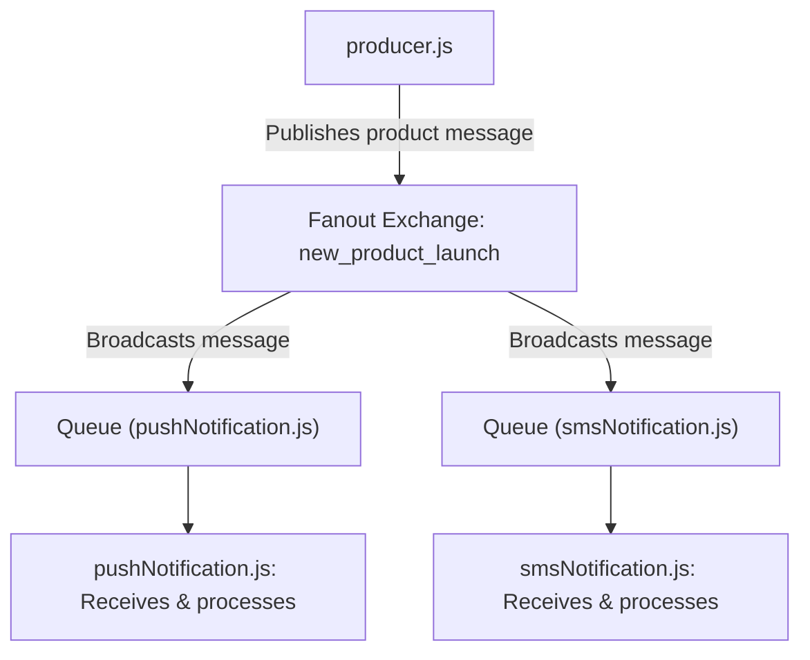

# Fanout Exchange - RabbitMQ

## Introduction
A Fanout Exchange in RabbitMQ is a type of exchange that routes messages to all queues bound to it, regardless of the routing key. It is the simplest form of message routing and is ideal for broadcasting messages to multiple consumers simultaneously.

## Explanation
When a producer sends a message to a fanout exchange, the exchange forwards the message to every queue that is bound to it. The routing key is ignored. This makes fanout exchanges perfect for scenarios where the same message needs to be delivered to multiple consumers.

## Use Case
Fanout exchanges are commonly used for:
- Broadcasting notifications or events to multiple services
- Real-time data feeds (e.g., live sports scores, stock tickers)
- Sending the same message to multiple microservices
- Pub/Sub (publish/subscribe) systems

## Architecture
- **Producer**: Sends messages to the fanout exchange.
- **Fanout Exchange**: Forwards every message to all bound queues, ignoring the routing key.
- **Queue(s)**: Receive all messages sent to the exchange.
- **Consumer(s)**: Listen to queues and process messages.

## Example
Suppose you have a fanout exchange named `logs` and three queues bound to it: `email_notifications`, `sms_notifications`, and `push_notifications`.
- When the producer sends a message to the `logs` exchange, all three queues receive a copy of the message, regardless of any routing key.

## Architecture Flow
1. The producer connects to RabbitMQ and sends a message to the fanout exchange.
2. The fanout exchange forwards the message to all bound queues.
3. Each consumer receives and processes the message from its respective queue.

### General Architecture Diagram
```mermaid
graph LR
    Producer["Producer"] -- "Message" --> FanoutExchange["Fanout Exchange"]
    FanoutExchange -- "" --> QueueEmail["Queue: email_notifications"]
    FanoutExchange -- "" --> QueueSMS["Queue: sms_notifications"]
    FanoutExchange -- "" --> QueuePush["Queue: push_notifications"]
    QueueEmail --> ConsumerA["Consumer: Email Service"]
    QueueSMS --> ConsumerB["Consumer: SMS Service"]
    QueuePush --> ConsumerC["Consumer: Push Service"]
```

---

## What Has Been Implemented in `/FanoutExchange`

This folder demonstrates a complete fanout exchange pattern in RabbitMQ using Node.js. The following scripts are included and are thoroughly commented for clarity:

- **producer.js**: Acts as the message producer. It connects to RabbitMQ, asserts a fanout exchange (`new_product_launch`), and publishes a new product launch message. This message is broadcast to all queues bound to the exchange.

- **pushNotification.js**: Represents a consumer service (e.g., push notifications). It creates a temporary queue, binds it to the fanout exchange, and listens for new product launch messages. Upon receiving a message, it processes and acknowledges it.

- **smsNotification.js**: Represents another consumer service (e.g., SMS notifications). Like the push notification service, it creates a temporary queue, binds it to the same fanout exchange, and listens for messages. It also demonstrates publishing a message and consuming it within the same script for demonstration purposes.

### How It Works Together
1. The **producer** sends a new product launch message to the fanout exchange.
2. Both **pushNotification** and **smsNotification** scripts, acting as consumers, have their own queues bound to the exchange.
3. When a message is published, both consumers receive a copy and process it independently.

This setup illustrates the broadcast nature of fanout exchanges, where every bound queue receives every message, enabling scalable and decoupled notification systems.

### Implementation Flow Diagram


---
This folder contains code examples demonstrating the use of a fanout exchange in RabbitMQ. All scripts are commented for easy understanding and learning.
