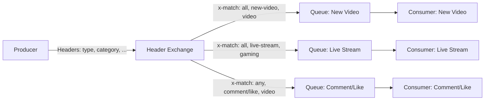
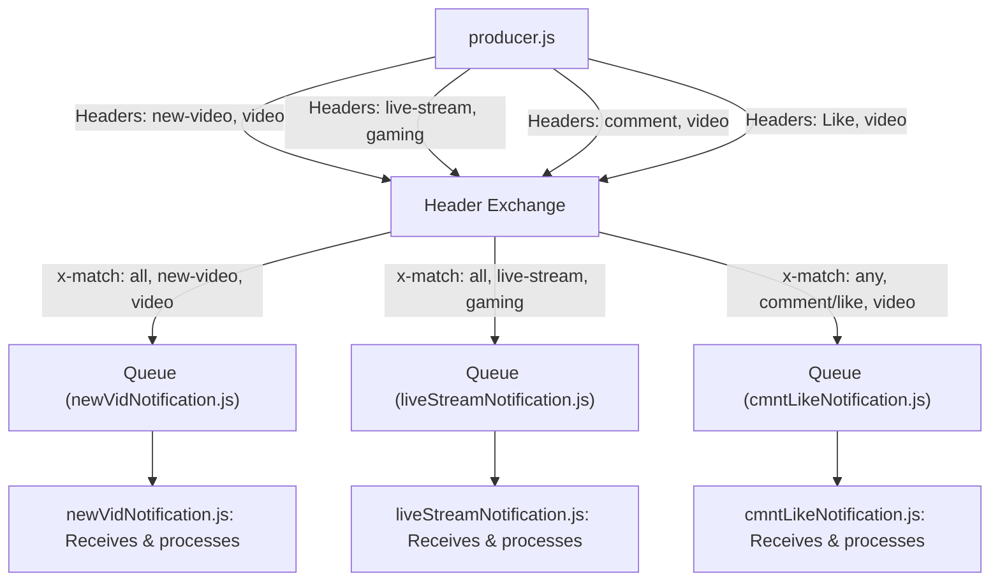

# Header Exchange - RabbitMQ

## Introduction
A Header Exchange in RabbitMQ routes messages to queues based on message header values instead of routing keys. This allows for highly flexible and complex routing logic, as messages are matched to queues using header attributes and logical conditions (e.g., match all, match any).

## Explanation
When a producer sends a message to a header exchange, it attaches a set of headers to the message. Queues are bound to the exchange with specific header requirements and a matching type (`x-match: all` or `x-match: any`). The exchange routes the message to all queues whose binding headers match the message headers according to the specified logic.

- `x-match: all`: All header values must match for the message to be routed to the queue.
- `x-match: any`: At least one header value must match for the message to be routed to the queue.

## Use Case
Header exchanges are ideal for:
- Complex filtering and routing scenarios
- Multi-attribute notification systems
- Content-based routing (e.g., notifications by type, category, or user segment)
- Systems where routing keys are insufficient for expressing routing logic

## Architecture
- **Producer**: Sends messages with custom headers to the header exchange.
- **Header Exchange**: Routes messages to queues based on header matching logic.
- **Queue(s)**: Bound to the exchange with specific header requirements.
- **Consumer(s)**: Listen to queues and process messages.

## Example
Suppose you have a header exchange named `header_exchange` and three queues:
- Queue 1 bound with `x-match: all`, `notification_type: new-video`, `content_type: video`
- Queue 2 bound with `x-match: all`, `notification_type: live-stream`, `content_type: gaming`
- Queue 3 bound with `x-match: any`, `notification_type-comment: comment`, `notification_type-Like: Like`, `content_type: video`

A message with headers `{x-match: all, notification_type: new-video, content_type: video}` will go to Queue 1. A message with `{x-match: any, notification_type-Like: Like, content_type: video}` will go to Queue 3.

## General Architecture Flow
1. The producer connects to RabbitMQ and sends a message with headers to the header exchange.
2. The header exchange matches the message headers against all queue bindings.
3. Each queue whose binding matches the message headers receives the message.
4. Consumers process messages from their respective queues.

### General Architecture Diagram

---

## What Has Been Implemented in `/HeaderExchange`

This folder demonstrates a header exchange pattern in RabbitMQ using Node.js. The following scripts are included and are thoroughly commented for clarity:

- **producer.js**: Sends notifications with various headers to the header exchange. Demonstrates sending new video, live stream, comment, and like notifications with different header combinations.
- **newVidNotification.js**: Consumes notifications for new video uploads. Binds a queue with `x-match: all`, `notification_type: new-video`, and `content_type: video`.
- **liveStreamNotification.js**: Consumes notifications for live streams. Binds a queue with `x-match: all`, `notification_type: live-stream`, and `content_type: gaming`.
- **cmntLikeNotification.js**: Consumes notifications for comments or likes. Binds a queue with `x-match: any`, `notification_type-comment: comment`, and `notification_type-Like: Like`.

### How It Works Together
1. The **producer** sends notifications with different headers to the header exchange.
2. Each consumer script binds to the exchange with specific header requirements.
3. When a message is published, only the consumer(s) whose queue binding matches the message headers receive and process the message.

This setup demonstrates the flexible and powerful routing capabilities of header exchanges, enabling content-based and multi-attribute message delivery.

### Implementation Flow Diagram

---
This folder contains code examples demonstrating the use of a header exchange in RabbitMQ. All scripts are commented for easy understanding and learning.
