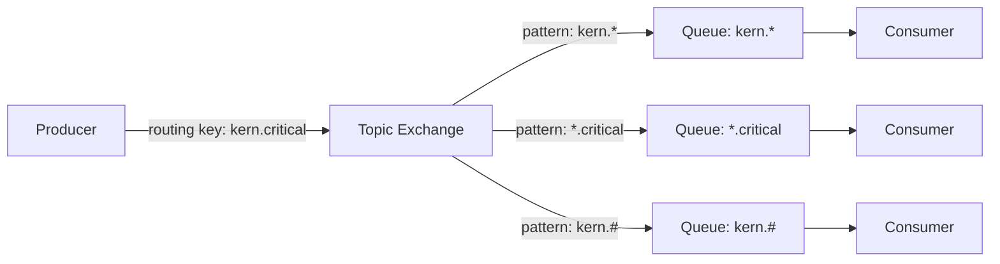

# Topic Exchange - RabbitMQ

## Introduction
A Topic Exchange in RabbitMQ routes messages to one or many queues based on matching between a message routing key and the pattern that was used to bind a queue to the exchange. It enables more complex routing logic using wildcards.

## Explanation
Topic exchanges use routing keys with words separated by dots (e.g., `user.info`, `order.created`). Bindings can use wildcards:
- `*` (star) matches exactly one word
- `#` (hash) matches zero or more words

This allows for flexible and powerful routing scenarios.

## Use Case
Topic exchanges are ideal for:
- Event-driven architectures
- Logging systems with multiple log levels and sources
- Notification systems with multiple categories and subcategories
- Any scenario requiring pattern-based message routing

## Architecture
- **Producer**: Sends messages with a routing key to the topic exchange.
- **Topic Exchange**: Routes messages to queues based on pattern matching between the routing key and the binding pattern.
- **Queue(s)**: Bound to the exchange with patterns (e.g., `user.*`, `order.#`).
- **Consumer(s)**: Listen to queues and process messages.

## Example
Suppose you have a topic exchange named `topic_logs` and three queues:
- Queue 1 bound with `kern.*`
- Queue 2 bound with `*.critical`
- Queue 3 bound with `kern.#`

A message with routing key `kern.critical` will go to all three queues.

## Architecture Flow
1. The producer connects to RabbitMQ and sends a message to the topic exchange with a routing key.
2. The topic exchange matches the routing key against all binding patterns and routes the message to the appropriate queue(s).
3. The consumer(s) receive and process the message from the queue.

### Architecture Diagram

---
This folder contains code examples demonstrating the use of a topic exchange in RabbitMQ. 